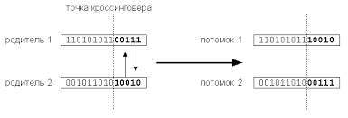

# Как написать генетический алгоритм (python)

Генетический алгоритм - алгоритм эмулирующий эволюцию, его главная идея - скрещивание. Особи с более хорошими генами имеют больший шанс скрестится и передать свой _генотип_ в следующие поколение.

> ## Тезарус
>
> _генотип_ - совокупность генов _индивидуума_
>
> _индивидуум_ - самостоятельно существующий живой организм (а в нашем случае не очень живой :blush:); особь
>
> _популяция_ - совокупность особей одного вида

Наш алгоритм будет оперировать с _индивидуумами_. Каждый индивидуум будет иметь генотип (массив генов). Составим алгоритм для создания нового поколения:

1. выбираем двух родителей (чем "лучше" гены, тем выше шанс выбора)
2. скрещиваем и получаем два новых индивидуума
3. Если поколение ещё не создано, переходим к пункту 1

Поскольку скрещиваются особи с лучшим генами (одна особь может поучаствовать в процессе скрещивания несколько раз), вся _популяция_ тоже будет со временем развиваться.

Для примера, напишем "Hello, world!" в мире генетических алгоритмов: генотип будет состоять из пяти чисел от 2 до 0. 2 - самый плохой ген, 0 - наилучший. В процессе эволюции генотипы изменятся из плохих (пример плохого генотипа - [2, 1, 2, 2, 1]) в хорошие (пример хорошего - [0, 0, 0, 0 0]).

Начнем писать алгоритм. Первое, что нужно сделать - создать класс индивидуума:

```python
class Individual:
    genotype: list # Класс содержит всего одно поле - генотип

    def __init__(self, genotype): # Конструктор принимает 1 аргумент - генотип
        self.genotype = genotype
```

Реализуем новый метод - скрещивание. Как аргумент он будет принимать вторую особь, а возвращать две новых. Но как скрещивать?

## Кроссинговер

Кроссинговер - процедура скрещивания, аналогичная с теми, что происходят в естественных условиях: в одинаковом месте, происходит разрез двух генотипов. После этого две отрезанные части меняют местами и сшивают.



[Картинка](http://www.ievbras.ru/ecostat/Kiril/Library/Book1/Content392/Content392.htm)

Это можно очень легко реализовать с помощью срезов. Создадим новый метод класса индивидуума:

```python
    def mutate(self, other):
        ...
```

Выберем точку кроссинговера:

```python
import random

...

class Individual:
    
    ...

    def mutate(self, other):
        point = random.randint(1, 3)
```

создади два новых генотипа с помощью срезов:

```python
    def mutate(self, other):
        point = random.randint(1, 3)
        new_gen1 = self.genotype[:point] + other.genotype[point:]
        new_gen2 = other.genotype[:point] + self.genotype[point:]

        return (Individual(new_gen1), Individual(new_gen2)) # Возвращаем две новых особи
```

## Мутация

Каждый ген с шансом 5% может изменится.

```python
    def mutate(self, other, probiblity=5):
        point = random.randint(1, 3)
        new_gen1 = self.genotype[:point] + other.genotype[point:]
        new_gen2 = other.genotype[:point] + self.genotype[point:]

        for i in range(len(new_gen1)):
            if random.randint(1, 100) <= probiblity:
                new_gen1[i] = random.randint(0, 2)
        for i in range(len(new_gen2)):
            if random.randint(1, 100) <= probiblity:
                new_gen2[i] = random.randint(0, 2)

        return (Individual(new_gen1), Individual(new_gen2)) # Возвращаем две новых особи
```

## Создание первого поколения

Самое первое поколение будет случайным:

```python
def create_first_generation(size):
    ind = [] # Список со всеми индивидууами
    for _ in range(size):
        ind.append(Individual([random.randint(0, 2) for _ in range(5)])) # создаём список из 5 случайных элементов от 0 до 2
    return ind 
```

## Вычисление приспособленности особи

Что бы выбирать лучших подителей, мы должны вичислять из приспособленность (англ. _fitness_). Добавим для этого отдельный метод в класс индивидуума:

```python
class Individual:

    ...

    @property # деоратор property позволяет вызывать метод без скобок
    def fitness(self):
        ...
```

Метод вычисления фитнесса будет возвращать значения от 0 до 1, где 1 - наиболее приспособленные индивидуумы. Для этого найдём сумму генотипа (сумма чисел самого плохого генотипа - 10, самого хорошего - 0), разделим на 10 и вычтем из единицы:

```python
    @property
    def fitness(self):
        return 1 - sum(self.genotype) / 10
```

## Выбор родителей

Вовремя создания нового поколения будем выбирать родителей следующим образом: чем выше фитнесс тем выше шанс стать родителем. Таким образом родители с лучшими генами будут передавать свои гены в следующие поколения.

Создадим функцию `choise_parents`, которая будет принимать как аргумент массив индивидуумов, а возвращать индексы двух родителей.

```python
def choise_parents(ind_arr):
    sum_ = 0
    p_arr = [] # Массив вероятностей
    for i in ind_arr:
        p_arr.append(i.fitness + sum_) # Добавляем в массив вероятностей фитнесс особи + сумма всех предыдущих элементов
        sum_ += i.fitness
    ind_number = random.uniform(0.0, sum_) # случайное дробное число
    ind1 = 0 # индекс первого родителя
    for i in range(len(p_arr)):
        if ind_number < p_arr[i]: # Пока p_arr[i] больше случайного числа, ни чего не делаем
            ind1 = i
            break
    ind_number = random.uniform(0.0, sum_)
    ind2 = 0
    for i in range(len(p_arr)):
        if ind_number < p_arr[i]:
            ind2 = i
            break
    return (ind1, ind2)
```

## Смена поколений

Копирование массива / создание нового - очень дорогая операция. Поэтому мы будем использовать два массива для четных поколений и для нечётных.

```python
even_gen = []
odd_gen = []

def generate(size, gen_count):
    for i in range(gen_count):
        if gen_count % 2 == 0:
            for i in range(size // 2):
                ind1, ind2 = choise_parents(even_gen) # Выбираем родителей
                odd_gen[i * 2], odd_gen[i * 2 + 1] = even_gen[ind1].mutate(even_gen[ind2])
        else:
            for i in range(size // 2):
                ind1, ind2 = choise_parents(odd_gen) # Выбираем родителей
                even_gen[i * 2], even_gen[i * 2 + 1] = odd_gen[ind1].mutate(odd_gen[ind2])
```

Осталось только запустить! Полный Файл который можно запустить можно найти в этой же директории.